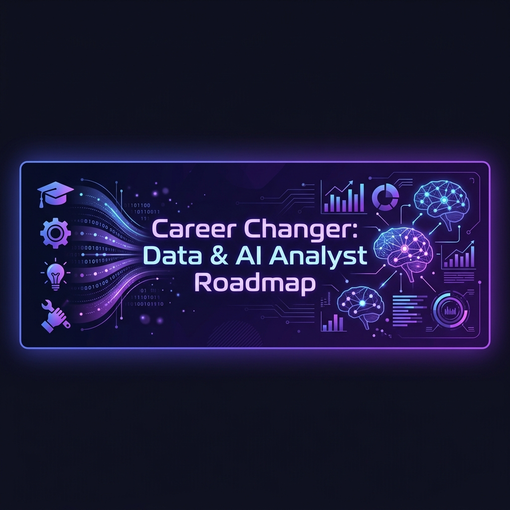

# Career Changer: From Any Degree to Data & AI Analyst

  

Welcome to the **Career Changer: From Any Degree to Data & AI Analyst Portal**! This repository is a ready-to-deploy, fully interactive Learning Management System (LMS) web application designed specifically for individuals from non-technical backgrounds (such as Finance, Humanities, HR, Logistics, or Healthcare) transitioning into the data and AI space.

👉 **[Launch the Interactive Career Changer Portal Live!](https://karidasd.github.io/career-changer-data-ai-roadmap/)**

---

## 🎮 Portal Features & Live Simulators

Unlike standard static guides, this repository deploys a complete single-page application with native client-side simulators:

1.  **Dynamic 4-Stage Roadmap**: Glowing visual cards mapping the exact skill curriculum across Excel, SQL, Python/Dashboards, and AI Agents.
2.  **Domain Pivot Calculator (19 Sciences)**: Organized dropdown separating Life, Physical, Formal, Social, Applied, and Humanities sciences. Select your background to instantly get:
    *   Your target role (e.g., *People Analytics Specialist*, *Cheminformatics Analyst*).
    *   Core industry KPIs to learn.
    *   A custom portfolio project idea.
    *   Search terms to find datasets on Kaggle.
3.  **Streamlit Web App Simulator**: View Streamlit Python code on the left and interact with a live simulated dashboard on the right (filtering regions, updating KPI metrics, and rendering interactive bar charts).
4.  **AI SQL Agent Simulator**: Interactive command-line terminal simulation showing the exact RAG pipeline—how a natural language question is translated into SQL, run on SQLite, and returned as a conversational summary.

---

## 🗺️ The 4-Stage Learning Path

### 📊 Stage 1: Modern Excel & AI Formula Engineering (Weeks 1-3)
*   **Objective**: Master data modeling and business diagnostics using the latest Excel features and AI prompts.
*   **Key Skills**: Dynamic Array spilling (`FILTER`, `UNIQUE`, `SORT`), next-gen lookups (`XLOOKUP`), and prompting LLMs to write complex nested calculations.
*   **Code & Practice**: [01-modern-excel-ai/](01-modern-excel-ai/)

### 🗄️ Stage 2: Analytical SQL & LLM Co-Pilots (Weeks 4-7)
*   **Objective**: Retrieve and model database tables using analytical structures and AI SQL generators.
*   **Key Skills**: Common Table Expressions (CTEs) for modular queries, Window Functions (`LAG()`, `DENSE_RANK()`) for trend and cohort analysis, and schema-based SQL prompting.
*   **Code & Practice**: [02-analytical-sql-agents/](02-analytical-sql-agents/)

### 🐍 Stage 3: Python Pandas & Streamlit Web Dashboards (Weeks 8-12)
*   **Objective**: Go beyond static scripts. Learn Pandas data manipulation and deploy interactive web applications.
*   **Key Skills**: Pandas aggregations (`groupby`, `pivot_table`) and building full-featured web dashboards in under 50 lines of code using **Streamlit**.
*   **Code & Practice**: [03-python-streamlit-dashboards/](03-python-streamlit-dashboards/)

### 🤖 Stage 4: AI Agents & Conversational RAG Analytics (Weeks 13+)
*   **Objective**: Build and understand the future of analytics—autonomous AI agents that read database tables.
*   **Key Skills**: Text-to-SQL translation, autonomous tool calls, and grounding LLM responses with SQL results (Retrieval-Augmented Generation).
*   **Code & Practice**: [04-ai-agents-rag-analytics/](04-ai-agents-rag-analytics/)

---

## 📁 Custom Portfolio Templates

To help you build your first project, we have created reusable templates in the [/templates](templates/) directory:
*   [my_first_dashboard_template.py](templates/my_first_dashboard_template.py): A template Streamlit script. Drag in your CSV, configure your columns, and launch your dashboard.
*   [analytical_sql_template.sql](templates/analytical_sql_template.sql): A skeleton SQL query demonstrating advanced analytical CTEs and partitions ready for your own dataset.

---

## 💡 How to Pivot Your Domain

The most successful data analysts do not erase their past—they combine it with technical skills. Here are examples of high-value transitions across all major scientific and professional categories:

*   **Finance/Accounting background** + SQL & BI = **Business Intelligence (BI) Analyst**
*   **Human Resources (HR) background** + Excel & Python = **People Analytics Specialist**
*   **Logistics/Supply Chain background** + SQL & Dashboards = **Operations Analyst**
*   **Biology/Healthcare background** + Statistics & Python = **Healthcare Data Analyst / Clinical Informatics**
*   **Humanities/Arts background** + LLM APIs & NLP = **Prompt Engineer / AI Operations Specialist**
*   **Education/Teaching background** + Statistics & SQL = **Learning Analytics Specialist / EdTech Analyst**
*   **Law/Legal background** + NLP & Compliance = **Legal Tech Analyst / Compliance Data Analyst**
*   **Psychology background** + Web Clickstreams & K-Means = **User Experience (UX) Researcher / Behavioral Analyst**
*   **Environmental/Agri background** + Time Series & Forecasting = **Environmental Data Analyst**
*   **Architecture/Civil Eng background** + Spatial Mapping & GIS = **Spatial Data Analyst / Real Estate BI**
*   **Hospitality/Tourism background** + SQL window functions = **Revenue Management Analyst**
*   **Sociology/Policy background** + Census data & Clustering = **Policy Analyst / Social Science Researcher**
*   **Journalism/Media background** + Text sentiment & metrics = **Audience Insights Analyst / Content Specialist**
*   **Chemistry/Materials background** + Regression & Process yields = **Cheminformatics Analyst / Process Analyst**
*   **Physics/Astronomy background** + Computations & Simulations = **Quantitative Research Analyst (Quant)**
*   **Geology/Earth background** + Spatial mapping & Sensors = **GIS & Geospatial Data Specialist**
*   **Mathematics/Statistics background** + Risk analytics & Modeling = **Risk Actuary / Quantitative Analyst**
*   **Economics background** + Econometrics & Index analysis = **Economic Policy Analyst / Econometrician**
